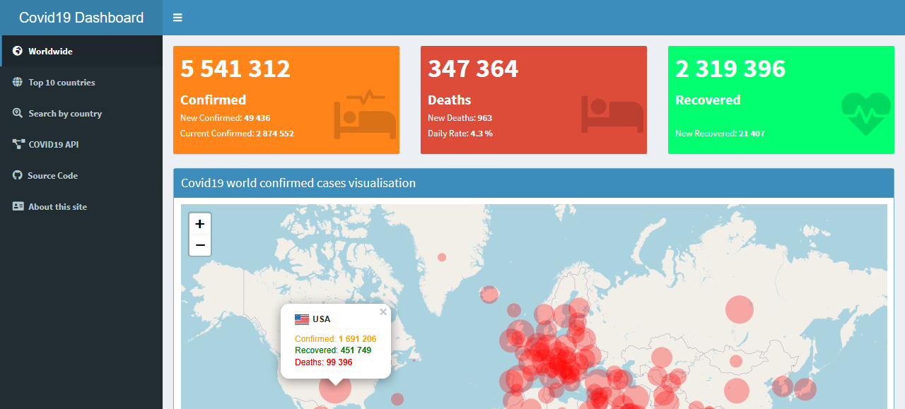

# covid19-dashboard
This's a covid19 dashboard, it's based on [the COVID-19 Data Analysis with R - Worldwide analysis report of the Novel Coronavirus](http://www.rdatamining.com/docs/Coronavirus-data-analysis-world.pdf).

The Data is sourced from [Worldometers](https://www.worldometers.info/coronavirus/).

# Shiny interface

# Resources
[Yanchang Zhao, COVID-19 Data Analysis with R – Worldwide. RDataMining.com, 2020](http://www.rdatamining.com/docs/Coronavirus-data-analysis-world.pdf)

[Worldometers](https://www.worldometers.info/coronavirus/)

